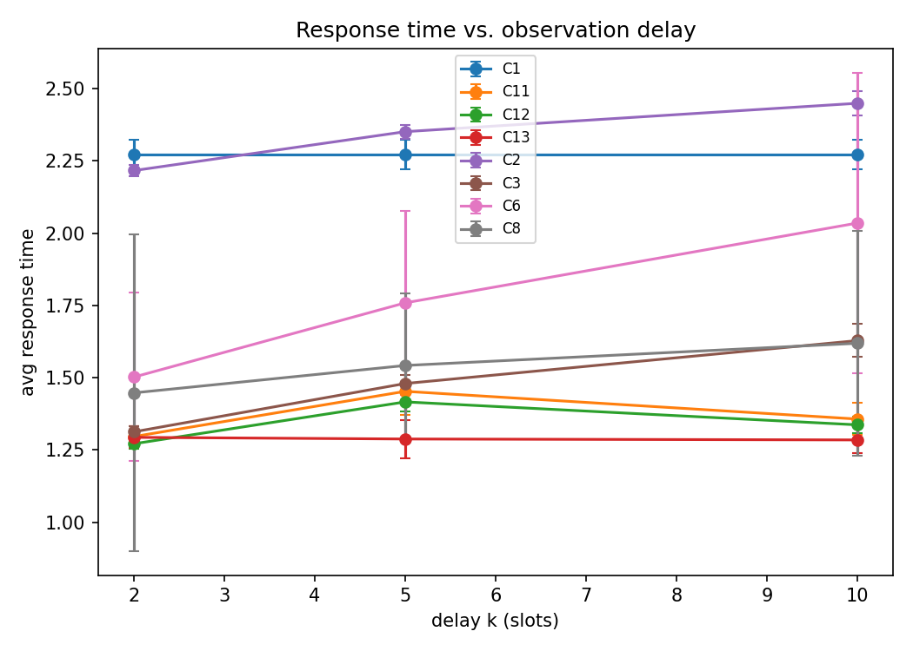
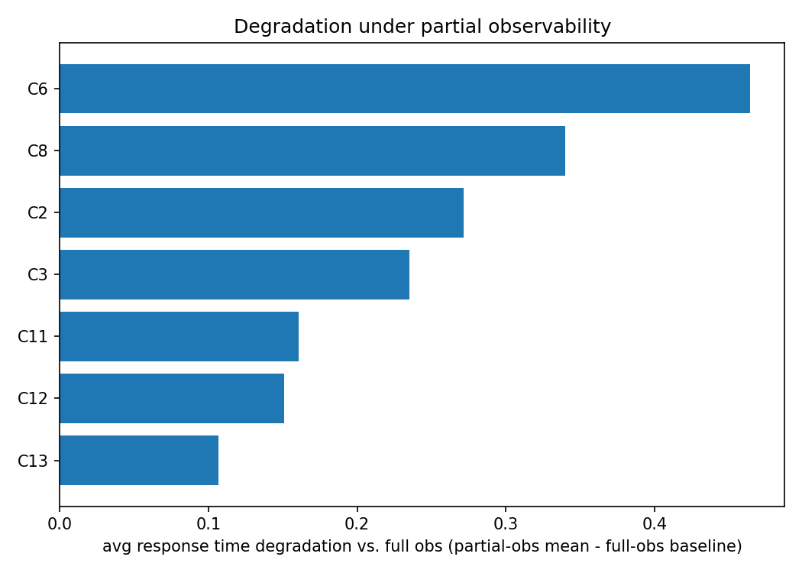
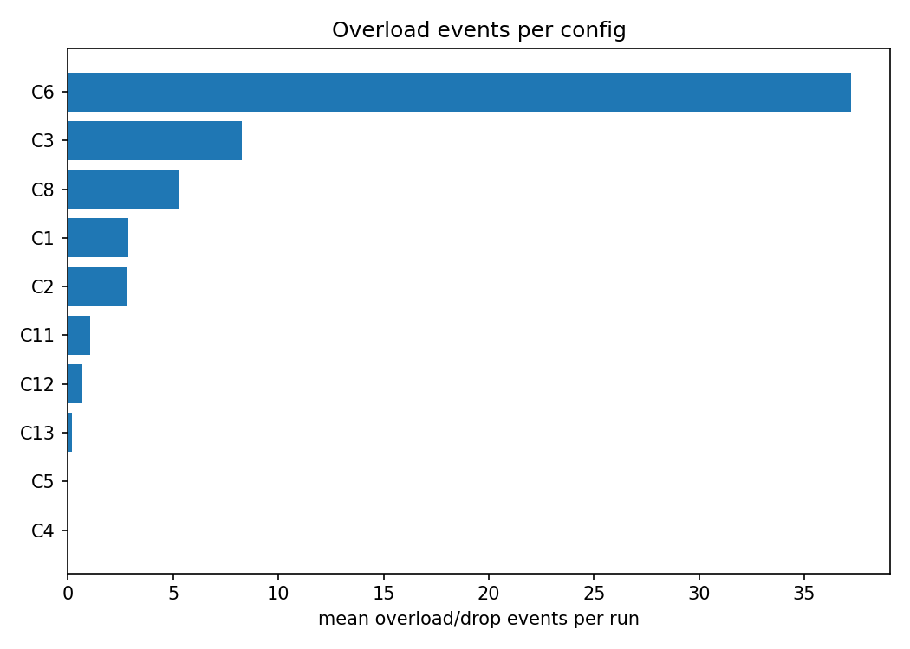

# Experiment Report

Auto-generated from results/raw/results.csv. Findings below are computed directly from the numbers; no conclusions beyond what the data shows.

## Mean avg response time by config x obs_mode, per traffic pattern

### bursty

| config | delay_10 | delay_2 | delay_5 | full | noise_delay | noise_high | noise_low |
|---|---|---|---|---|---|---|---|
| Round Robin | 2.209 | 2.209 | 2.209 | 2.209 | 2.209 | 2.209 | 2.209 |
| Q-learning + belief filter (extension) | 1.366 | 1.288 | 1.404 |  | 1.363 | 1.268 | 1.152 |
| SED + belief filter (extension) | 1.311 | 1.259 | 1.387 |  | 1.306 | 1.2 | 1.149 |
| Hybrid: Q + belief, SED fallback (extension) | 1.295 | 1.283 | 1.246 |  | 1.289 | 1.261 | 1.152 |
| Least Connections | 2.417 | 2.21 | 2.346 | 1.982 | 2.356 | 2.055 | 2.01 |
| Shortest Expected Delay | 1.556 | 1.301 | 1.459 | 1.134 | 1.411 | 1.202 | 1.158 |
| Q-learning (full obs) |  |  |  | 1.134 |  |  |  |
| Q-learning (partial obs) | 2.276 | 1.726 | 1.712 |  | 1.77 | 1.421 | 1.242 |
| Q-learning (partial obs + dispatch corrector) | 1.576 | 1.706 | 1.611 |  | 1.728 | 1.421 | 1.242 |

### cyclical

| config | delay_10 | delay_2 | delay_5 | full | noise_delay | noise_high | noise_low |
|---|---|---|---|---|---|---|---|
| Round Robin | 2.292 | 2.292 | 2.292 | 2.292 | 2.292 | 2.292 | 2.292 |
| Q-learning + belief filter (extension) | 1.331 | 1.277 | 1.461 |  | 1.419 | 1.224 | 1.165 |
| SED + belief filter (extension) | 1.331 | 1.266 | 1.405 |  | 1.32 | 1.206 | 1.152 |
| Hybrid: Q + belief, SED fallback (extension) | 1.264 | 1.275 | 1.335 |  | 1.332 | 1.226 | 1.165 |
| Least Connections | 2.441 | 2.213 | 2.343 | 1.966 | 2.363 | 2.056 | 2.0 |
| Shortest Expected Delay | 1.658 | 1.302 | 1.469 | 1.134 | 1.432 | 1.208 | 1.159 |
| Q-learning (full obs) |  |  |  | 1.137 |  |  |  |
| Q-learning (partial obs) | 1.879 | 1.376 | 1.937 |  | 2.09 | 1.499 | 1.228 |
| Q-learning (partial obs + dispatch corrector) | 1.746 | 1.336 | 1.553 |  | 1.809 | 1.499 | 1.228 |

### steady

| config | delay_10 | delay_2 | delay_5 | full | noise_delay | noise_high | noise_low |
|---|---|---|---|---|---|---|---|
| Round Robin | 2.314 | 2.314 | 2.314 | 2.314 | 2.314 | 2.314 | 2.314 |
| Q-learning + belief filter (extension) | 1.375 | 1.324 | 1.494 |  | 1.372 | 1.245 | 1.159 |
| SED + belief filter (extension) | 1.37 | 1.291 | 1.457 |  | 1.367 | 1.224 | 1.157 |
| Hybrid: Q + belief, SED fallback (extension) | 1.296 | 1.323 | 1.284 |  | 1.283 | 1.246 | 1.159 |
| Least Connections | 2.489 | 2.226 | 2.363 | 1.957 | 2.392 | 2.054 | 1.991 |
| Shortest Expected Delay | 1.671 | 1.337 | 1.512 | 1.14 | 1.46 | 1.217 | 1.164 |
| VI/PI (model-based, full obs, steady) |  |  |  | 1.14 |  |  |  |
| Q-learning (full obs) |  |  |  | 1.195 |  |  |  |
| Q-learning (partial obs) | 1.949 | 1.405 | 1.628 |  | 1.565 | 1.272 | 1.183 |
| Q-learning (partial obs + dispatch corrector) | 1.535 | 1.3 | 1.463 |  | 1.708 | 1.272 | 1.183 |

## Plots

## Findings

- Under full observability, **Shortest Expected Delay** achieves the lowest mean response time across traffic patterns.
- **bursty** traffic, mean over delay modes only: Shortest Expected Delay = 1.438 (12.2 drops); Q-learning (partial obs) = 1.905 (73.5 drops); Q-learning (partial obs + dispatch corrector) = 1.631 (7.9 drops); Q-learning + belief filter (extension) = 1.353 (0.6 drops); SED + belief filter (extension) = 1.319 (0.5 drops); Hybrid: Q + belief, SED fallback (extension) = 1.275 (0.1 drops)
- **cyclical** traffic, mean over delay modes only: Shortest Expected Delay = 1.476 (23.9 drops); Q-learning (partial obs) = 1.731 (68.7 drops); Q-learning (partial obs + dispatch corrector) = 1.545 (9.1 drops); Q-learning + belief filter (extension) = 1.356 (1.0 drops); SED + belief filter (extension) = 1.334 (1.0 drops); Hybrid: Q + belief, SED fallback (extension) = 1.291 (0.1 drops)
- **steady** traffic, mean over delay modes only: Shortest Expected Delay = 1.506 (17.7 drops); Q-learning (partial obs) = 1.661 (47.0 drops); Q-learning (partial obs + dispatch corrector) = 1.433 (5.5 drops); Q-learning + belief filter (extension) = 1.398 (3.2 drops); SED + belief filter (extension) = 1.372 (1.9 drops); Hybrid: Q + belief, SED fallback (extension) = 1.301 (0.3 drops)
- Mean training convergence step (moving-avg reward within 5% of final): Q-learning + belief filter (extension)=22318, Hybrid: Q + belief, SED fallback (extension)=22318, Q-learning (full obs)=27087, Q-learning (partial obs)=16950, Q-learning (partial obs + dispatch corrector)=19286
- **Q-learning (partial obs)** has the highest mean overload/drop count (37.23 per run) across the grid.