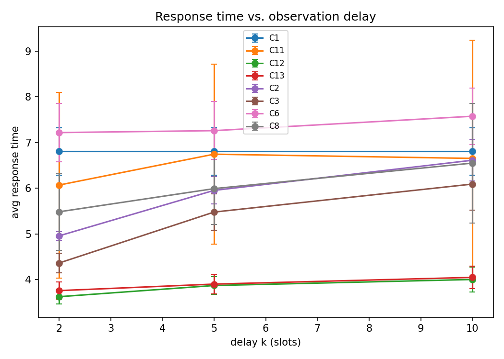
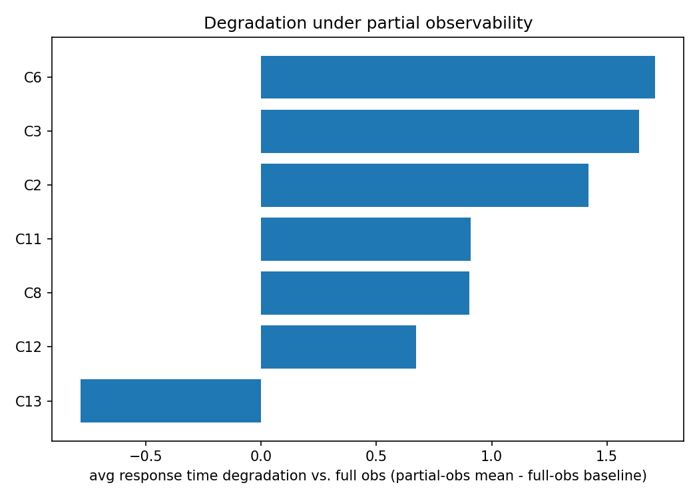
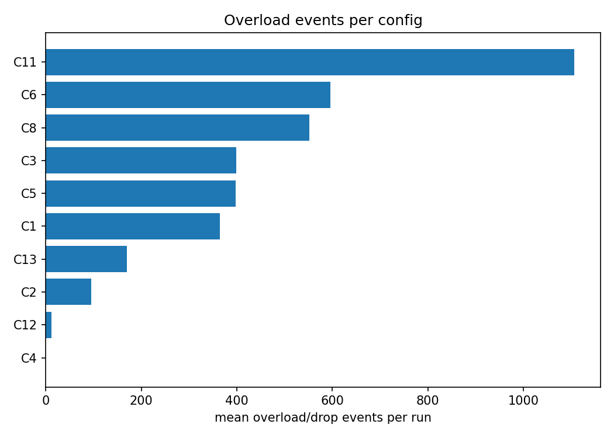

# Experiment Report

Auto-generated from results/raw/results.csv. Findings below are computed directly from the numbers; no conclusions beyond what the data shows.

## Mean avg response time by config x obs_mode, per traffic pattern

### bursty

| config | delay_10 | delay_2 | delay_5 | full | noise_delay | noise_high | noise_low |
|---|---|---|---|---|---|---|---|
| Round Robin | 6.212 | 6.212 | 6.212 | 6.212 | 6.212 | 6.212 | 6.212 |
| Q-learning + belief filter (extension) | 5.208 | 4.83 | 5.566 |  | 5.259 | 4.996 | 4.648 |
| SED + belief filter (extension) | 3.682 | 3.443 | 3.641 |  | 3.634 | 3.126 | 2.934 |
| Hybrid: Q + belief, SED fallback (extension) | 3.739 | 3.59 | 3.649 |  | 3.671 | 4.843 | 4.648 |
| Least Connections | 6.074 | 4.851 | 5.59 | 3.898 | 5.602 | 4.279 | 4.019 |
| Shortest Expected Delay | 5.445 | 4.112 | 5.029 | 2.839 | 4.808 | 3.117 | 2.958 |
| Q-learning (full obs) |  |  |  | 4.254 |  |  |  |
| Q-learning (partial obs) | 6.891 | 6.913 | 6.62 |  | 6.4 | 5.943 | 5.416 |
| Q-learning (partial obs + dispatch corrector) | 6.699 | 4.898 | 5.521 |  | 5.889 | 5.943 | 5.416 |

### cyclical

| config | delay_10 | delay_2 | delay_5 | full | noise_delay | noise_high | noise_low |
|---|---|---|---|---|---|---|---|
| Round Robin | 6.797 | 6.797 | 6.797 | 6.797 | 6.797 | 6.797 | 6.797 |
| Q-learning + belief filter (extension) | 5.856 | 5.398 | 5.777 |  | 5.827 | 5.426 | 4.868 |
| SED + belief filter (extension) | 4.003 | 3.628 | 3.887 |  | 3.902 | 3.278 | 3.052 |
| Hybrid: Q + belief, SED fallback (extension) | 4.091 | 3.742 | 3.916 |  | 3.967 | 5.034 | 4.868 |
| Least Connections | 6.623 | 4.972 | 5.989 | 3.887 | 5.917 | 4.336 | 4.03 |
| Shortest Expected Delay | 6.05 | 4.367 | 5.433 | 2.958 | 5.204 | 3.273 | 3.079 |
| Q-learning (full obs) |  |  |  | 4.708 |  |  |  |
| Q-learning (partial obs) | 7.664 | 7.038 | 7.278 |  | 7.382 | 5.784 | 5.456 |
| Q-learning (partial obs + dispatch corrector) | 5.853 | 5.26 | 5.83 |  | 6.025 | 5.784 | 5.456 |

### steady

| config | delay_10 | delay_2 | delay_5 | full | noise_delay | noise_high | noise_low |
|---|---|---|---|---|---|---|---|
| Round Robin | 7.416 | 7.416 | 7.416 | 7.416 | 7.416 | 7.416 | 7.416 |
| Q-learning + belief filter (extension) | 8.895 | 7.979 | 8.893 |  | 6.804 | 6.331 | 6.08 |
| SED + belief filter (extension) | 4.321 | 3.803 | 4.081 |  | 4.102 | 3.405 | 3.171 |
| Hybrid: Q + belief, SED fallback (extension) | 4.314 | 3.943 | 4.137 |  | 4.154 | 5.827 | 6.08 |
| Least Connections | 7.143 | 5.046 | 6.28 | 3.848 | 6.201 | 4.391 | 4.017 |
| Shortest Expected Delay | 6.78 | 4.605 | 5.971 | 3.039 | 5.726 | 3.409 | 3.158 |
| VI/PI (model-based, full obs, steady) |  |  |  | 2.918 |  |  |  |
| Q-learning (full obs) |  |  |  | 6.417 |  |  |  |
| Q-learning (partial obs) | 8.175 | 7.705 | 7.885 |  | 7.875 | 6.401 | 6.218 |
| Q-learning (partial obs + dispatch corrector) | 7.101 | 6.292 | 6.623 |  | 7.324 | 6.401 | 6.218 |

## Plots

## Findings

- Under full observability, **VI/PI (model-based, full obs, steady)** achieves the lowest mean response time across traffic patterns.
- **bursty** traffic, mean over delay modes only: Shortest Expected Delay = 4.862 (483.1 drops); Q-learning (partial obs) = 6.808 (524.8 drops); Q-learning (partial obs + dispatch corrector) = 5.706 (285.3 drops); Q-learning + belief filter (extension) = 5.201 (252.6 drops); SED + belief filter (extension) = 3.589 (10.5 drops); Hybrid: Q + belief, SED fallback (extension) = 3.659 (17.5 drops)
- **cyclical** traffic, mean over delay modes only: Shortest Expected Delay = 5.283 (738.9 drops); Q-learning (partial obs) = 7.327 (748.3 drops); Q-learning (partial obs + dispatch corrector) = 5.648 (747.3 drops); Q-learning + belief filter (extension) = 5.677 (546.2 drops); SED + belief filter (extension) = 3.839 (19.3 drops); Hybrid: Q + belief, SED fallback (extension) = 3.916 (36.0 drops)
- **steady** traffic, mean over delay modes only: Shortest Expected Delay = 5.785 (1124.9 drops); Q-learning (partial obs) = 7.922 (1172.1 drops); Q-learning (partial obs + dispatch corrector) = 6.672 (1110.1 drops); Q-learning + belief filter (extension) = 8.589 (4081.7 drops); SED + belief filter (extension) = 4.068 (28.3 drops); Hybrid: Q + belief, SED fallback (extension) = 4.131 (47.5 drops)
- Mean training convergence step (moving-avg reward within 5% of final): Q-learning + belief filter (extension)=3236, Hybrid: Q + belief, SED fallback (extension)=3236, Q-learning (full obs)=5766, Q-learning (partial obs)=1901, Q-learning (partial obs + dispatch corrector)=2892
- **Q-learning + belief filter (extension)** has the highest mean overload/drop count (1107.10 per run) across the grid.