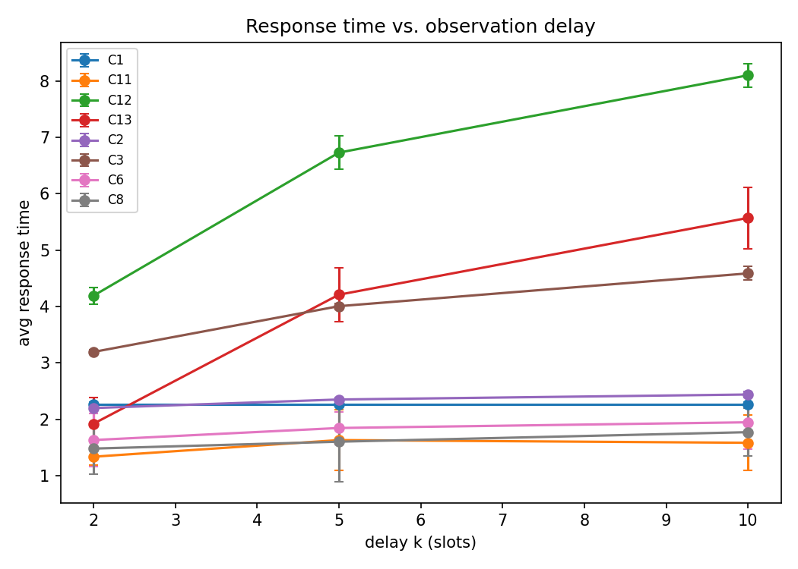
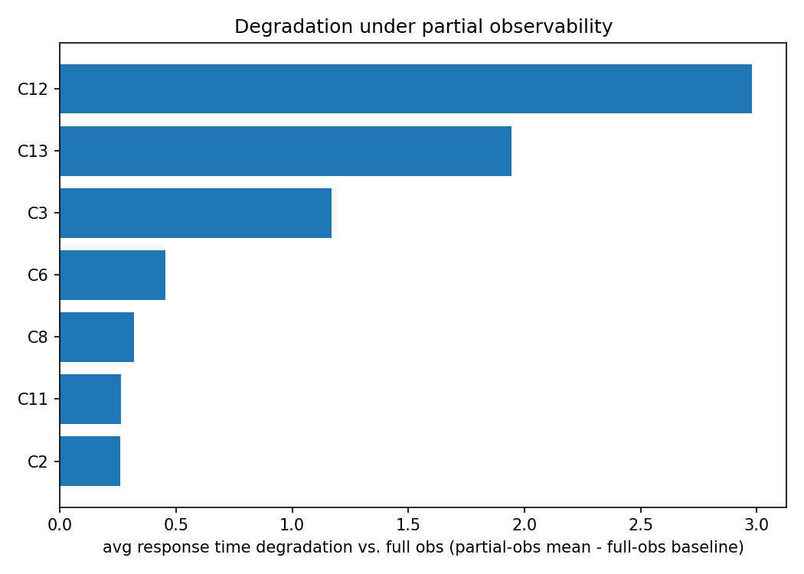
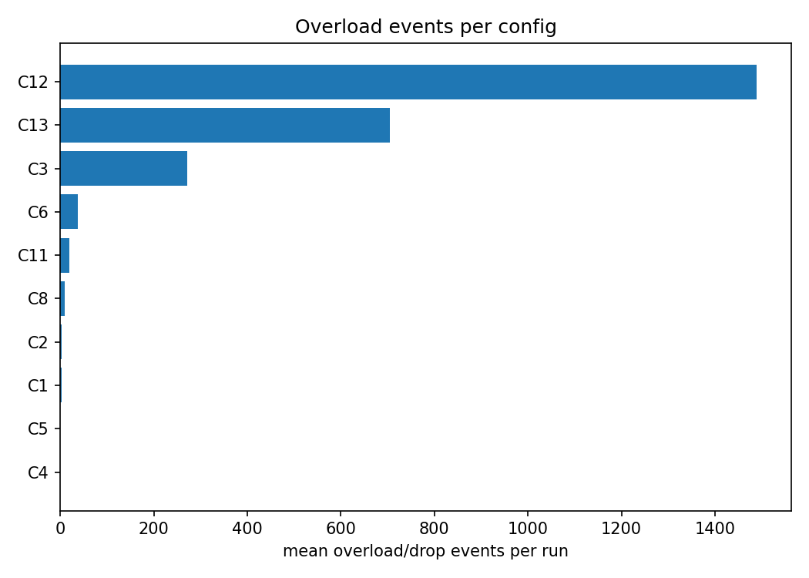

# Experiment Report

Auto-generated from results/raw/results.csv. Findings below are computed directly from the numbers; no conclusions beyond what the data shows.

## Mean avg response time by config x obs_mode, per traffic pattern

### bursty

| config | delay_10 | delay_2 | delay_5 | full | noise_delay | noise_high | noise_low |
|---|---|---|---|---|---|---|---|
| Round Robin | 2.224 | 2.224 | 2.224 | 2.224 | 2.224 | 2.224 | 2.224 |
| Q-learning + belief filter (extension) | 1.548 | 1.279 | 1.422 |  | 1.735 | 1.249 | 1.212 |
| SED + belief filter (extension) | 8.17 | 4.345 | 7.046 |  | 7.027 | 3.354 | 2.649 |
| Hybrid: Q + belief, SED fallback (extension) | 5.053 | 1.736 | 3.774 |  | 3.941 | 1.25 | 1.212 |
| Least Connections | 2.402 | 2.201 | 2.326 | 1.99 | 2.335 | 2.058 | 2.005 |
| Shortest Expected Delay | 4.471 | 3.235 | 4.001 | 2.327 | 3.841 | 2.639 | 2.432 |
| Q-learning (full obs) |  |  |  | 1.143 |  |  |  |
| Q-learning (partial obs) | 2.063 | 1.718 | 1.643 |  | 1.514 | 1.444 | 1.194 |
| Q-learning (partial obs + dispatch corrector) | 1.951 | 1.285 | 2.004 |  | 1.302 | 1.444 | 1.194 |

### cyclical

| config | delay_10 | delay_2 | delay_5 | full | noise_delay | noise_high | noise_low |
|---|---|---|---|---|---|---|---|
| Round Robin | 2.255 | 2.255 | 2.255 | 2.255 | 2.255 | 2.255 | 2.255 |
| Q-learning + belief filter (extension) | 1.827 | 1.442 | 1.967 |  | 1.372 | 1.313 | 1.168 |
| SED + belief filter (extension) | 8.27 | 4.222 | 6.765 |  | 6.671 | 3.27 | 2.583 |
| Hybrid: Q + belief, SED fallback (extension) | 5.636 | 2.101 | 4.132 |  | 4.342 | 1.319 | 1.168 |
| Least Connections | 2.436 | 2.189 | 2.346 | 1.975 | 2.363 | 2.051 | 2.0 |
| Shortest Expected Delay | 4.573 | 3.18 | 3.974 | 2.271 | 3.811 | 2.606 | 2.385 |
| Q-learning (full obs) |  |  |  | 1.147 |  |  |  |
| Q-learning (partial obs) | 1.744 | 1.644 | 1.885 |  | 1.573 | 1.402 | 1.2 |
| Q-learning (partial obs + dispatch corrector) | 1.744 | 1.309 | 1.435 |  | 1.5 | 1.402 | 1.2 |

### steady

| config | delay_10 | delay_2 | delay_5 | full | noise_delay | noise_high | noise_low |
|---|---|---|---|---|---|---|---|
| Round Robin | 2.306 | 2.306 | 2.306 | 2.306 | 2.306 | 2.306 | 2.306 |
| Q-learning + belief filter (extension) | 1.384 | 1.297 | 1.514 |  | 1.372 | 1.29 | 1.179 |
| SED + belief filter (extension) | 7.859 | 4.007 | 6.376 |  | 6.226 | 3.151 | 2.486 |
| Hybrid: Q + belief, SED fallback (extension) | 6.029 | 1.93 | 4.726 |  | 4.994 | 1.295 | 1.179 |
| Least Connections | 2.488 | 2.216 | 2.388 | 1.964 | 2.409 | 2.05 | 1.992 |
| Shortest Expected Delay | 4.723 | 3.173 | 4.047 | 2.209 | 3.873 | 2.573 | 2.336 |
| VI/PI (model-based, full obs, steady) |  |  |  | 2.172 |  |  |  |
| Q-learning (full obs) |  |  |  | 1.184 |  |  |  |
| Q-learning (partial obs) | 2.043 | 1.543 | 2.017 |  | 1.848 | 1.261 | 1.298 |
| Q-learning (partial obs + dispatch corrector) | 1.629 | 1.857 | 1.379 |  | 1.381 | 1.261 | 1.298 |

## Plots

## Findings

- Under full observability, **Q-learning (full obs)** achieves the lowest mean response time across traffic patterns.
- **bursty** traffic, mean over delay modes only: Shortest Expected Delay = 3.902 (395.0 drops); Q-learning (partial obs) = 1.808 (91.4 drops); Q-learning (partial obs + dispatch corrector) = 1.747 (44.9 drops); Q-learning + belief filter (extension) = 1.416 (9.8 drops); SED + belief filter (extension) = 6.521 (1560.0 drops); Hybrid: Q + belief, SED fallback (extension) = 3.521 (578.6 drops)
- **cyclical** traffic, mean over delay modes only: Shortest Expected Delay = 3.909 (497.0 drops); Q-learning (partial obs) = 1.758 (58.6 drops); Q-learning (partial obs + dispatch corrector) = 1.496 (7.5 drops); Q-learning + belief filter (extension) = 1.745 (77.1 drops); SED + belief filter (extension) = 6.419 (2117.1 drops); Hybrid: Q + belief, SED fallback (extension) = 3.956 (1031.9 drops)
- **steady** traffic, mean over delay modes only: Shortest Expected Delay = 3.981 (742.5 drops); Q-learning (partial obs) = 1.867 (64.9 drops); Q-learning (partial obs + dispatch corrector) = 1.622 (2.2 drops); Q-learning + belief filter (extension) = 1.398 (0.6 drops); SED + belief filter (extension) = 6.080 (3003.4 drops); Hybrid: Q + belief, SED fallback (extension) = 4.228 (1568.2 drops)
- Mean training convergence step (moving-avg reward within 5% of final): Q-learning + belief filter (extension)=20427, Hybrid: Q + belief, SED fallback (extension)=20427, Q-learning (full obs)=26733, Q-learning (partial obs)=17412, Q-learning (partial obs + dispatch corrector)=19038
- **SED + belief filter (extension)** has the highest mean overload/drop count (1489.70 per run) across the grid.